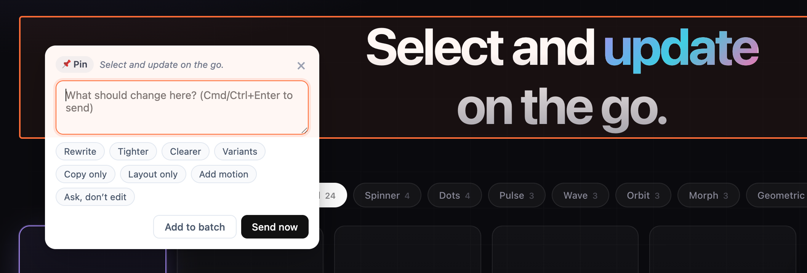

# make-interactive

> Turn any HTML file into a live, comment-driven canvas inside Claude Code.



A Claude Code skill that wraps any HTML output (mockup, report, prototype, spec) in a local server with a Figma-style comment overlay. Drop pins on UI elements or highlight text in reports — each comment becomes an instruction Claude applies to the source file, and the page hot-reloads.

Built for designers, PMs, and engineers who iterate on HTML deliverables and want a tight feedback loop without leaving the browser — like Google Docs comments, but for any HTML page.

  

---

## What it does

Two use cases, one skill:

**1. Design iteration** — Pin comments on UI elements
- Hover any element → click → comment ("make this CTA bigger and orange", "switch to a 2-col layout", "explore a darker variant")
- Claude edits the HTML, browser hot-reloads, you see the change immediately

**2. Content review** — Highlight text in reports/specs
- Select any text → floating "Comment" button → comment ("rewrite this clearer", "this seems wrong because…", "split into bullets")
- Same loop: Claude edits, page reloads

---

## Install

### One-liner (curl)

```bash
curl -fsSL https://raw.githubusercontent.com/seant-ctrl/make-interactive/main/install.sh | bash
```

### Manual (git clone)

```bash
git clone https://github.com/seant-ctrl/make-interactive.git
cd make-interactive
./install.sh
```

Both methods install to `~/.claude/commands/make-interactive/`. Restart Claude Code (or reload skills) after install.

**Requires**: Claude Code, Python 3.7+ (stdlib only — no pip deps), and a browser.

---

## How to use

### 1. Launch

In Claude Code, point the skill at any HTML file:

```
/make-interactive path/to/your-file.html
```

The skill also picks up natural phrases like *"rend cette page interactive"*, *"comment on this page"*, or *"iterate on this HTML"*. Optional `--port 8000` if 7321 is taken.

Claude boots a local server, opens the URL in your browser, and starts watching for comments. You'll see a floating **"Comment"** pill in the top-right corner of the page.

### 2. Enter comment mode

Click the **"Comment"** pill (or press <kbd>C</kbd>). Two sub-modes appear:

| Mode | What it's for | How to use |
|---|---|---|
| **📌 Pin element** | UI / layout / visual changes | Hover any element → click → modal opens anchored to that element |
| **✏️ Highlight text** | Copy / report / spec edits | Select any text in the page → floating "💬 Comment" button → click it |

### 3. Write the comment

The modal shows:
- A **preview** of what you're commenting on (element snippet or selected text)
- A **textarea** for your instruction
- **8 quick-action chips** (optional) that shape how Claude will interpret it

You can either:
- **"Send now"** — submit immediately, Claude starts working
- **"Add to batch"** — queue this comment as a draft, keep dropping more pins, then hit the toolbar's **"Send (N)"** button to submit everything at once

Pressing <kbd>Cmd/Ctrl</kbd>+<kbd>Enter</kbd> in the textarea = Send now.

### 4. Watch Claude apply

After you send, the pin turns from gray (draft) → orange (pending). Claude reads each comment, edits the source HTML, and the browser hot-reloads automatically via Server-Sent Events. Resolved pins turn green with a ✓ tooltip showing what was applied.

### 5. Iterate

Drop more pins. Combine modes. Switch viewport size. The queue is persistent — even if you close the browser, your comments stay in `.make-interactive-queue.json` next to the HTML, restored next time you launch.

### 6. Stop

Say `stop`, `done`, `ferme`, or close the browser. Claude kills the server and confirms.

---

## Recipes

**Iterating on a Claude-generated mockup**
1. Ask Claude to generate an HTML mockup of a feature
2. `/make-interactive mockup.html`
3. Pin: *"Make the hero CTA orange and add an outline variant next to it"* + chip **Variants**
4. Pin: *"Move the testimonials section above the pricing"* + chip **Layout only**
5. Send batch → Claude does both, page reloads with the changes

**Reviewing a PRD or report**
1. Have Claude generate a report as HTML
2. `/make-interactive report.html`
3. Switch to **✏️ Highlight text** mode
4. Highlight the intro → *"Tighter, one sentence"* + chip **Tighter**
5. Highlight a claim → *"This seems wrong — Apollo doesn't do that. Fix?"* + chip **Ask, don't edit**
6. Send → Claude rewrites the intro and adds an `<aside>` reply next to the questionable claim

**Comparing visual variants**
1. Pin any element → *"Show me 3 variants: minimal, bold, playful"* + chip **Variants**
2. Claude inserts a side-by-side block right there. Comment on the winner: *"Keep variant 2 and remove the others"*

---

## All features

### Activation
- Slash command `/make-interactive <path/to/file.html>`
- Natural-language triggers (FR + EN)
- Optional `--port <n>` argument (default 7321)
- <kbd>C</kbd> toggles comment mode at any time; <kbd>Esc</kbd> exits

### Pin mode (UI iteration)
- Real-time hover outline follows your cursor (orange, 2px)
- Click any element → modal anchored to your click position
- Pin badge in teardrop shape, numbered, sits on the element's top-right corner
- Multiple pins on the same element **cascade horizontally** (22px offset) — no stacking
- `mousedown` + `click` intercepted → page's own handlers (buttons, links, onclick) can't fire while you're commenting

### Select mode (content review)
- Highlight any text → floating **"💬 Comment"** button appears next to the selection
- Click it → modal opens with the selected text preserved as context
- Ideal for PRDs, reports, specs, longform content

### Comment modal
- Compact (360px wide), anchored to your click but always kept on-screen
- **Preview** of the target (element snippet or selected text, truncated)
- **Textarea** with placeholder
- **Quick-action chips** (pick one, optional)
- Two send modes: **Send now** (immediate) or **Add to batch** (queue more)
- Bounce-in animation, designer-tasteful palette

### Quick-action chips
Tell Claude *how* to interpret your comment without spelling it out:

| Chip | What it tells Claude |
|---|---|
| **Rewrite** | Rewrite the targeted text/element cleaner, keep meaning |
| **Tighter** | Make copy or layout more compact |
| **Clearer** | Simplify language or structure |
| **Variants** | Produce 2–3 visual variants inline |
| **Copy only** | Only change wording, don't touch layout/styles |
| **Layout only** | Only change layout/structure, keep wording |
| **Add motion** | Add a tasteful CSS transition/animation |
| **Ask, don't edit** | You're asking, not editing — reply in an `<aside>` next to the element |

### Batch workflow
- "Add to batch" → draft pin appears (pulsing gray), modal closes, you keep going
- Toolbar shows live count: **Send (3)**
- Click a draft pin to delete it (remaining pins re-pack automatically)
- One POST submits the whole batch — Claude processes them as a coherent set

### Pin states (color-coded)

| State | Color | Meaning |
|---|---|---|
| Draft | Gray (pulsing) | Local only, not yet submitted |
| Pending | Orange | Submitted, Claude is working |
| Resolved | Green ✓ | Claude applied the change |
| Dismissed | Hidden | You removed it |

Hover any pin → tooltip with the original comment (or `✓ <applied note>` if resolved). **Click** any sent pin → popover with the full comment, the quick-action used, the applied note (if resolved), plus:
- **Focus element** — smooth-scrolls to the target with a quick orange flash
- **Dismiss** — removes the pin and marks the comment dismissed in the queue

### Live reload
- **Server-Sent Events** stream pushes a reload event whenever Claude edits the source file
- Browser refreshes automatically, pin badges restored from the persistent queue
- A subtle toast shows *"Updated by Claude — reloading…"* before the reload

### Persistence
- All comments stored in `<html-dir>/.make-interactive-queue.json`
- Survives server restarts — becomes a free changelog of your iteration
- Each entry stores: `selector`, `xpath`, `previewHTML`, `comment`, `quickAction`, `viewport`, `anchor`, `status`, `appliedNote`, `createdAt`

### Robustness
- **Shadow DOM isolation** — your page's CSS can't bleed into the overlay (and vice versa)
- **`composedPath()` event detection** — bulletproof across React, Vue, Svelte, vanilla
- **`pointer-events: none`** on the overlay shell except interactive bits → clicks pass through where you expect
- **Z-index 2147483647** (max safe int) — sits above any modal, toast, or sticky bar your page might have
- Heartbeat-protected SSE connection (15s ping)

### Stack
- **Python stdlib only** server (no pip install needed)
- **Vanilla JS** overlay (no framework, no bundler)
- **400ms file-watcher polling** for cross-platform reliability
- **Threaded HTTP server** supports multiple SSE clients

### Keyboard shortcuts

| Key | Action |
|---|---|
| <kbd>C</kbd> | Toggle comment mode |
| <kbd>Esc</kbd> | Close modal / exit mode |
| <kbd>Cmd</kbd>+<kbd>Enter</kbd> (or <kbd>Ctrl</kbd>+<kbd>Enter</kbd>) | Send the current comment immediately |

---

## How it works

```
┌──────────────┐   POST /api/comments    ┌─────────────────┐
│   Browser    │ ──────────────────────► │  Python server  │
│  (overlay)   │ ◄── SSE /api/events ─── │   (stdlib)      │
└──────────────┘                         └────────┬────────┘
                                                  │ stdout
                                                  ▼
                                         ┌─────────────────┐
                                         │  Claude Code    │
                                         │  (Monitor tool) │
                                         └────────┬────────┘
                                                  │ Edit
                                                  ▼
                                         ┌─────────────────┐
                                         │   HTML file     │ ──┐
                                         └─────────────────┘   │
                                                  ▲            │ mtime
                                                  │            ▼
                                                  └──── file watcher
```

The server emits structured stdout lines (`[ready]`, `[comment] {json}`, `[batch]`, `[reload]`) that Claude Code watches via the Monitor tool. Each comment triggers Claude to read the queue file, edit the HTML, and the browser hot-reloads.

---

## Uninstall

```bash
curl -fsSL https://raw.githubusercontent.com/seant-ctrl/make-interactive/main/uninstall.sh | bash
```

Or just `rm -rf ~/.claude/commands/make-interactive/`.

---

## Author

Made by [@seant-ctrl](https://github.com/seant-ctrl). Bug reports and PRs welcome.

---

## License

[MIT](LICENSE) — fork, modify, share.
